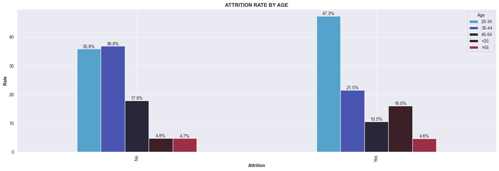
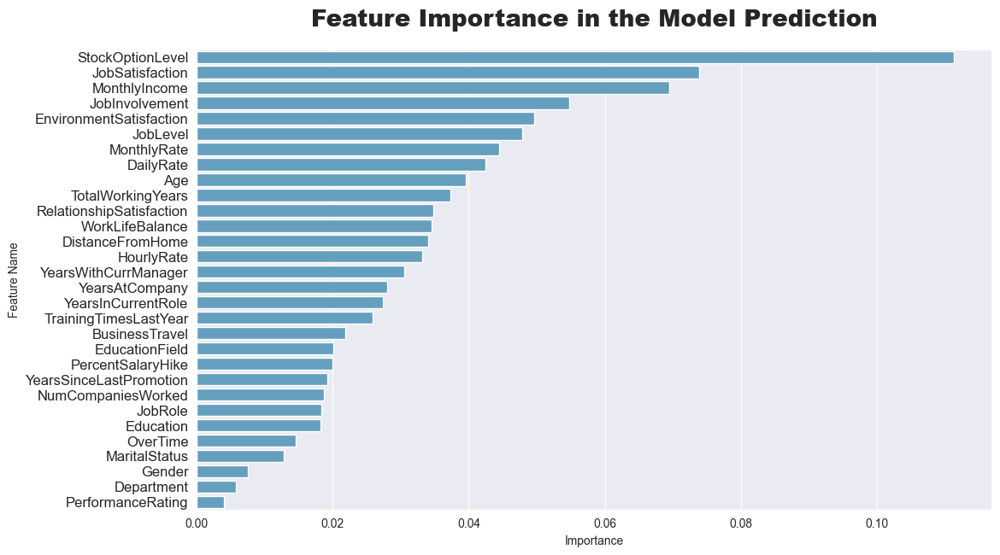

# **HR-ATTRITION-MODELLING USING RANDOM FOREST**

### **Project Overview**

**Employee attrition** refers to the gradual yet deliberate reduction in a company’s workforce, typically occurring when employees leave and are not replaced. This turnover can be **voluntary** (resignations, retirements) or **involuntary** (terminations, layoffs). While some attrition is natural, high or unmanaged attrition can significantly disrupt business operations.

Attrition can negatively impact a company’s **workflow**, **employee morale**, and **client satisfaction**. In severe cases, persistent attrition may even threaten a company’s ability to operate effectively or remain in business.

#### **Common Causes of Employee Attrition:**

* Low or uncompetitive pay
* Desire for a different work environment
* Lack of work-life balance
* Poor management practices
* Inadequate growth opportunities or compensation

To prevent these issues from escalating, it's critical for companies to **monitor**, **analyze**, and **understand** the underlying reasons behind employee departures. This knowledge enables businesses to proactively implement strategies that foster retention and maintain productivity.

### **Project Objectives**

1. **Conduct a comprehensive attrition analysis** for the company to understand employee behavior and trends.
2. **Develop machine learning model** (Random Forest) to predict which employees are likely to leave and identify key factors influencing attrition.
3. **Provide actionable insights and recommendations** to reduce attrition based on analytical findings.
4. **Create an interactive dashboard** for the Human Resources (HR) department to visually track and monitor attrition trends in real time.

---
## **CONCLUSIONS AND RECOMENDATIONS**

### **Conclusions**

From our analysis, several key insights emerged regarding employee attrition:

* **Overall Attrition Rate**: The company’s attrition rate stands at **16.1%**, indicating that the majority of employees are retained.

* **Age**: Younger employees **(typically aged 18–35)** show the highest attrition rates, indicating that early-career employees may be more likely to leave for better opportunities or due to dissatisfaction. In contrast, older employees **(aged 50 and above)** exhibit very low attrition, reflecting greater job stability or satisfaction in later career stages.

* **Education Level**: Employees with the **lowest education level** have the highest attrition, suggesting that **higher educational attainment may be linked to better retention**.

* **Satisfaction Metrics**: Employees reporting **low satisfaction** in **job satisfaction, environment satisfaction, relationship satisfaction**, and **work-life balance** tend to have lower retention rates.

* **Feature Importance (Model Insight)**: According to the machine learning model, the top five features contributing to attrition are:

  * **Stock Option Level**
  * **Job Satisfaction**
  * **Monthly Income**

  Conversely, the **least important features** include:

  * **Performance Rating**
  * **Department**
  * **Gender**

### **Recommendations**

Based on these insights, the following actions are recommended to reduce attrition:

1. **Expand the use of employee stock ownership plans (ESOPs)** and tie them to performance or tenure to incentivize long-term commitment

2. **Strengthen employee engagement strategies** that target  the younger age groups  through mentorship programs, career development paths, and recognition initiatives.

3. **Review Compensation Structures**: like offering financial wellness programs or incentives and introducing performance based bonuses.

4. **Address Work-Life Balance and Satisfaction**: Regularly assess employee satisfaction and implement initiatives such as flexible hours, wellness programs, or anonymous feedback systems.

